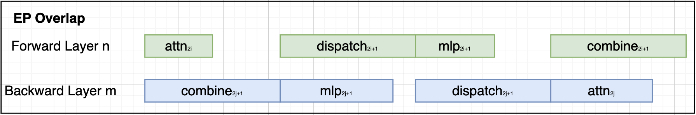
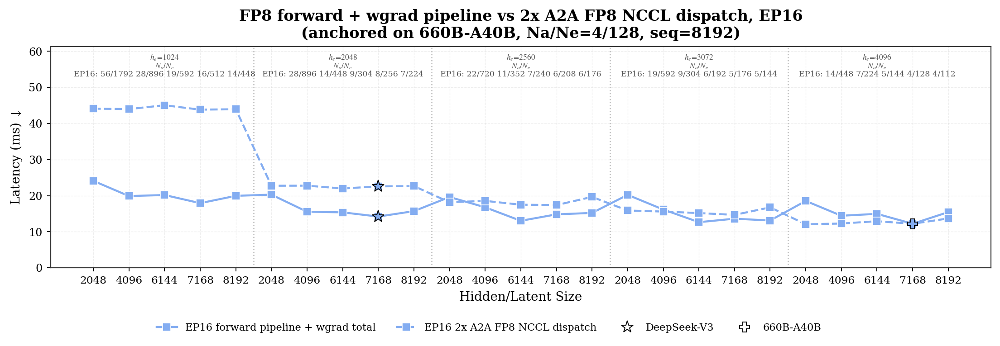
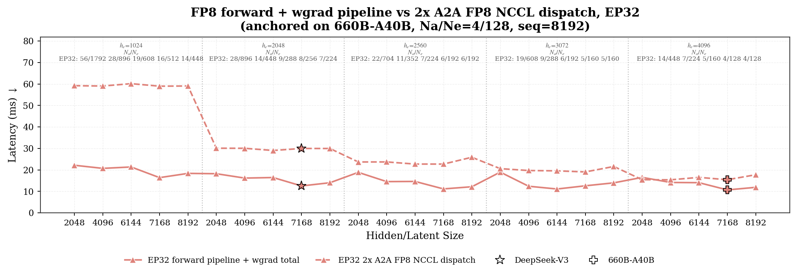

## 1. MoE Model Architecture
After calculations and experiments, I propose the following 2 draft model configs for Apertus-v2:
1. **Non-latent: MoE-650B-A42B**
	```yaml
		# general config
		NUM_LAYERS=61
		HIDDEN_SIZE=7168
		FFN_HIDDEN_SIZE=14336
		
		# moe layer config
		MOE_LAYER_FREQ='[0,1,0,1,0,1,0,1]+[1]*53'
		MOE_FFN_HIDDEN_SIZE=4096
		MOE_SHARED_FFN_HIDDEN_SIZE=4096
		NUM_EXPERTS=128
		TOPK=4
	```

2. **Latent: MoE-650B-A43B**
	```yaml
# general config
NUM_LAYERS=61
HIDDEN_SIZE=8192
FFN_HIDDEN_SIZE=14336

# moe layer config
MOE_LAYER_FREQ='[0,1,0,1,0,1,0,1]+[1]*53'
MOE_LATENT_SIZE=4096
MOE_FFN_HIDDEN_SIZE=3072
MOE_SHARED_FFN_HIDDEN_SIZE=6144
NUM_EXPERTS=288
TOPK=8
	```

> [!NOTE]
> **Between these 2 models**: 
> - Non-MoE is **a corse-grained MoE model (large expert + less activated)** with large expert size, but token throughput friendly in our infrastructure.
> - Latent MoE projection is used to **trade for a fine-grained MoE model (small expert + more activated )** with on-par token throughput.

Both models are anchored on DeepSeek-V3 for total parameter size (~630B) and activated parameter size (~40B), with changes based on system considerations.
- **Why not copy DeepSeek-V3 configs?** 
	
	Because the model architecture is not efficient for training in our infrastructure. Specifically, due to the 8 / 128 sparsity and 7168 hidden size, it presents **high communication bottleneck**. 
- **What are the changes?**
	- **For non-latent MoE:**
		Only expert size is changed for this model, and hence the TopK. It is generally a corse-grained DeepSeek-V3 and in test it has prominent token throughput.
		1. **Larger Expert Size: 2048 $\rightarrow$ 4096** and **Less Expert Number and TopK**:
			- maintain similar model size and activated size
			- mitigate EP communication bottleneck
			- increase expert granularity $\rightarrow$ Corse-grained MoE
	- **For latent MoE:**
		1. **Latent MoE projection: 4096**
			- mitigate EP communication bottleneck
			- reduce expert granularity $\rightarrow$  Fine-grained MoE
		2. **Larger Hidden Size: 7168 $\rightarrow$ 8192**
			- increase attention module computation intensity to overlap with BF16 combine
			- given latent projection in MoE layer, it might be better to have large model size for representation capacity
		3. **Larger Expert Size: 2048 $\rightarrow$ 3072**
			- maintain similar expert granularity
			- increase MoE layer computation intensity
		4. **Increased Expert Number: 256 $\rightarrow$ 288**
			- maintain similar model size and layer number
		5. **Slightly reduced activated ratio: 3.125% $\rightarrow$ 2.778%**
			- maintain similar activated parameter size
			- mitigate EP communication bottleneck
	- **For both models:**
		1. (optional) **Interleaved Dense+MoE in first few layers**
			- reduce memory pressure for first few PP ranks
		2. (optional) **Setup 1 dense layer with LM head** 
			- reduce memory pressure for the last PP rank
- **How these 2 models perform for training throughput?**

	Due to nodes limitation, I tested with 29-layer models on 64 nodes.

	| Model                        | GPUs | Setup        | Tokens/s/GPU | MFU   |
	| ---------------------------- | ---- | ------------ | ------------ | ----- |
	| **Latent-MoE-650B-A43B-29L** | 256  | EP16-PP8-TP4 | ~1690         | 25.3% |
	| **MoE-650B-A42B-29L**                    | 256  | EP16-PP8-TP4 | ~1720         |    26.0%   |
	
	For the full size model, it should be roughly half of the throughput, which gives **~800 tokens/s/gpu** in balanced scenario.
## 2. Explanations
There are considerations and explanations rooted from system-level considerations. At a high-level:
- **Memory Utilization**: the model has to be fitted into GH200 memory for training
- **Token Throughput:** the model has to be trained efficiently in the cluster
- **(optional) Latency:** the model has to be served efficiently in the cluster

**Memory Utilization**

GH200 has **96GB HBM**, where it will be filled with:
1. Intermediate activations
2. FP32 main gradients
3. FP32 optimizer states
4. BF16 model weights (only attention module if experts are offloaded)

Hence, the model should be designed to maximize the utilization of GPU memory at parallel setup. Analysis will be given below.

**Token Throughput**

We need a target for the performance we expect to train a the large MoE model. According to the documentation, we will use 15T - 20T tokens for pre-training. Let's take 17.5T as the mean value. Given 4096 GPUs and 3 months:
$$\rm{TokenThroughput} = \frac{17.5e12}{4096 \cdot 90 \cdot 24 \cdot 3600} = 550\ tokens/s/gpu$$

This is the expected average token throughput in real training. For optimal balance throughput with `--force-load-balancing`:
$$\rm{TokenThroughput'} = \frac{550}{0.8} = 687\ tokens/s/gpu$$where 0.8 is a penalty factor to compensate for the gap between real training throughput and balanced throughput in test. Hence, we need **at least 687 tokens/s/gpu** for throughput test.

### 2.1 Preliminary
I first define symbols that are necessary to build context in MoE model. 

**Fixed setup:**

| Setup            | Reason                                                              |
| ---------------- | ------------------------------------------------------------------- |
| PP = 16          | An empirical value for a 600B MoE model                             |
| TP = 4           | Upper-bound for intra-node TP. If memory permits, we can use TP = 2 |
| EP = 16          | If network improves, we can use EP = 32 and reduce TP               |
| SeqLen = 8192    | -                                                                   |
| VocabSize = 334k | 200k text + 130k image + 4k audio                                   |
| MBS = 2          | -                                                                   |


**Model**:

| Symbol    | Def                                                         |
| --------- | ----------------------------------------------------------- |
| $N_e$     | Total number of routed experts                              |
| $N_a$     | Activated routed experts per token (top-$K$)                |
| $H$       | Hidden size                                                 |
| $H_{lat}$ | MoE latent projection size                                  |
| $h_e$     | Intermediate size of an expert                              |
| $L_{moe}$ | Number of MoE layers                                        |
| $M$       | Tokens assigned to each expert in the **balanced scenario** |

**System:**

| Symbol | Def |
| ---------------- | ---------------------------------------------------------- |
| $N_{gpu}$ | World size |
| $TP, PP, EP$ | Tensor / pipeline / expert parallel size |
| $ETP$ | Expert tensor parallel size (always **$=1$** in our setup) |
| $G$ | GPUs per node ($=4$ on the Alps GH200 nodes) |
| $DP$ | $N_{gpu}/(TP\cdot PP)$ |
| $EDP$ | $N_{gpu}/(EP\cdot ETP\cdot PP) = N_{gpu}/(EP\cdot PP)$ |
| $\beta_\text{inter}$ | Inter-node A2A bandwidth, $\approx 25$ GB/s |
| $\beta_\text{intra}$ | Intra-node (NVLink) A2A bandwidth, $\gg \beta_\text{inter}$ |
| $\tau$ | Number of tokens hold in one device **after dispatch** |
| $D$ | Size of tokens hold in one device **after dispatch** |
| $b$       | Bytes per element of the dispatch payload (BF16 = 2, FP8 = 1) |

**Pre-build:**
1. Balanced tokens-per-expert:
	$$M = \frac{mbs\cdot seq\cdot N_a}{N_e}\cdot\frac{DP}{EDP} = mbs\cdot seq\cdot\frac{EP}{TP}\cdot\frac{N_a}{N_e}\quad\text{tokens}$$
2. Balanced per-device token payload
	$$\tau \;\equiv\; \underbrace{\frac{N_e}{EP}}_{\text{experts/rank}}\cdot\, M \;=\; \frac{mbs\cdot seq\cdot N_a}{TP}\quad\text{tokens}$$
3. Balanced dispatch communication volume
	$$V_\text{disp} = \underbrace{2\cdot mbs \cdot seq \cdot b \cdot}_{\text{constant}} \text{min}(H,H_{lat})\cdot\frac{N_a (EP-1)}{TP \cdot EP}\quad\text{bytes}$$
4. Per-device memory cost model
	$$
	\begin{aligned}
	&\text{Memory} = W + G + O + A\\
	&W = W_{dense} + W'_{moe} && \text{(bf16 weights, TP+EP+PP)}\\
	&G = 2(W_{dense}+W_{moe}) && \text{(fp32 main grad, unsharded)}\\
	&O = (1+\omega)\Big(\tfrac{2W_{dense}}{DP}+\tfrac{2W_{moe}}{EDP}\Big) && \text{(fp32 optimizer states, ZeRO‑1)}\\
	&A = \sum_{c\in\text{chunks}(r)} n_c\big(\delta_c A_{\text{dense}}+\mu_c A_{\text{moe}}\big)+Z_r && \text{(in‑flight–microbatches)}
	\end{aligned}
	$$

### 2.2 Trade-offs
Compared to the dense model, Mixtrue-of-Expert model introduces extra Expert Parallel communications which are slow in our training infrastructure. During the training, we can mitigate or hide the communication latency with low precisions and computations:


Hence, one of the key points for our MoE model is the **'sweet point' between MoE communication and computation**. It is necessary to make them balanced.

For communication, it is about the message size for dispatch and combine. For computation, it is about the problem size in MoE layer. Based on the preliminary, we can have:

$$ \text{MoE Communication} \propto \{H |H_{lat}, N_a\}$$

$$\text{MoE Computation} \propto \{H|H_{lat},h_e,N_e,\frac{N_a}{N_e}\}$$

With the calculations in 2.1, we can then design:
- memory estimator to estimate memory consumption
- benchmarks to search for an communication-computation balanced point
### 2.3 Sweep
I setup sweep of 2 steps:
1. Micro-benchmark sweep on $H, H_{lat}, h_e$ to narrow down candidates
2. Model-level sweep on $H, H_{lat}, h_e$ candidates from step 1

**Micro-benchmark Sweep**

For step 1, the following configs are used for MoE communication and computation in micro-benchmarks:
$$H \in \{6144, 7168, 8192\}$$
$$H_{lat} \in \{2048,4096\}$$
$$h_e \in \{1024,2048,2560,3072,4096\}$$
Other configurations (i.e. $N_e$ and $N_a$) are calculated to match a roughly 600B-A40B MoE model (anchored on DeepSeek-V3). 

The purpose of the micro-benchmark is to simulate the overlap pipeline in training under fixed setup and balanced scenario. Based on the simulation results, we can narrow down the scope of sweep on real models.
> Attention module is not simulated, but will be observed in step 2 



The conclusions we can derive from the micro-benchmark:

- Hidden size is not the primary factor for MoE layer computational and communicational costs.
- Small expert granularity ($he\in\{1024, 2048, 2560\}$) is not optimal for our cluster, which will be communication-bottlenecked for sure. Hence, DeepSeek-V3 architecture is not optimal for us.
- Latent MoE $H\in \{2048, 4096\}$ will turn the model into computation-bottlenecked in our cluster, which is what we want.

**Model-level Sweep**

From step 1, I include the following configs:
$$H \in \{6144, 7168, 8192\}$$
$$H_{lat} \in \{2048,4096\}$$
$$h_e \in \{3072,4096\}$$
This gives us 6 + 12 = 18 model configs. I use a 13-layer model (~110B, with ~7B activated) on 64 GPUs to do throughput tests. 

Due to the cluster problem, I cannot get a stable number between different runs for the same workload, and I haven't organized the data I collected for plotting and presenting. 


