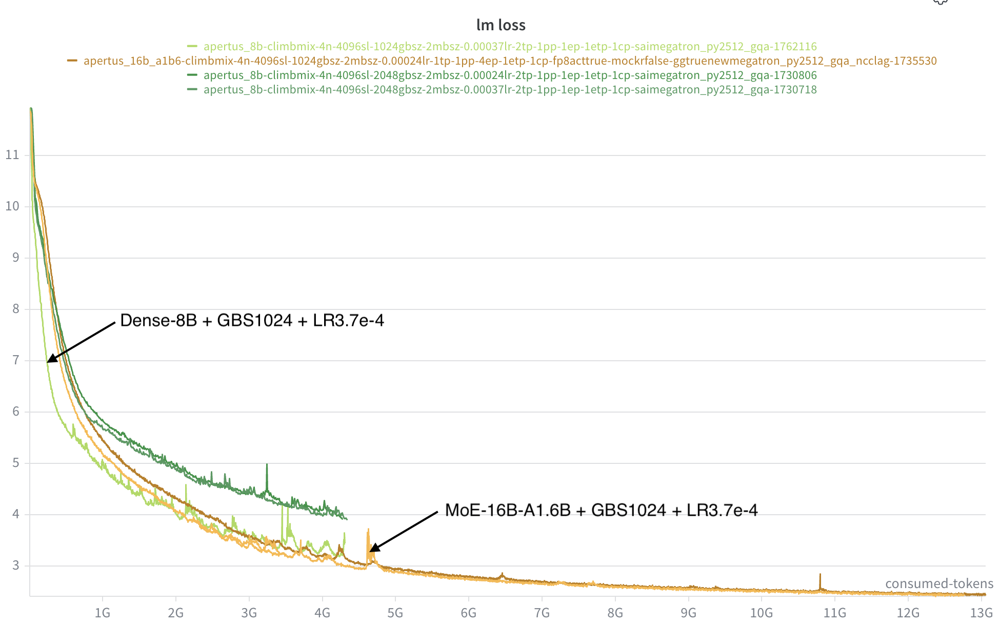
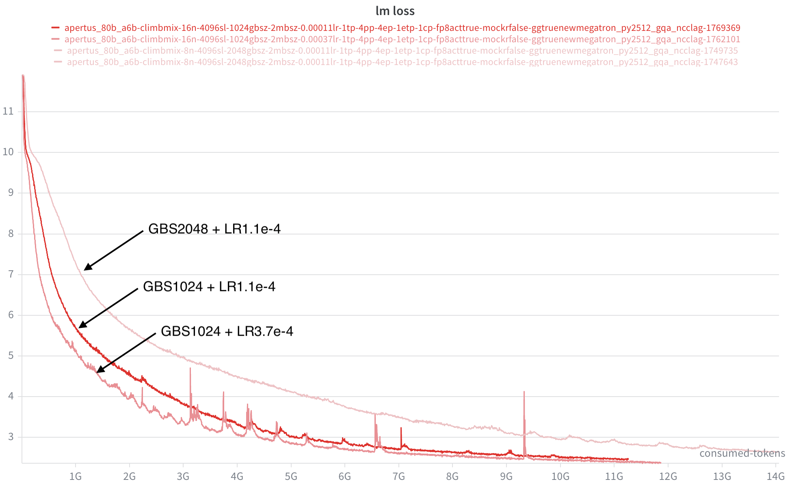
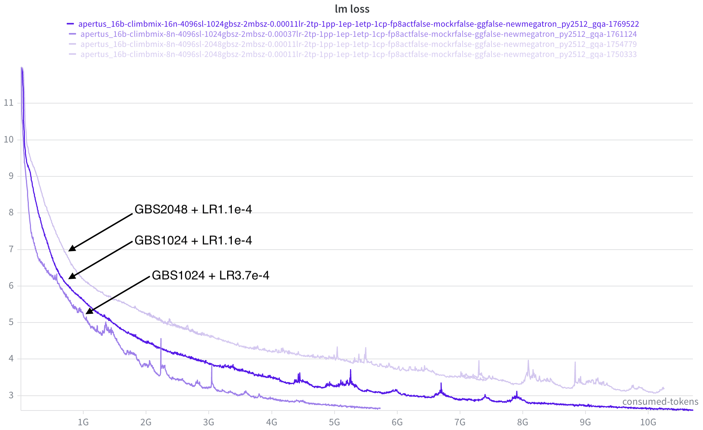
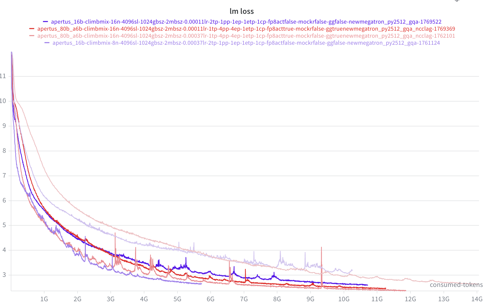
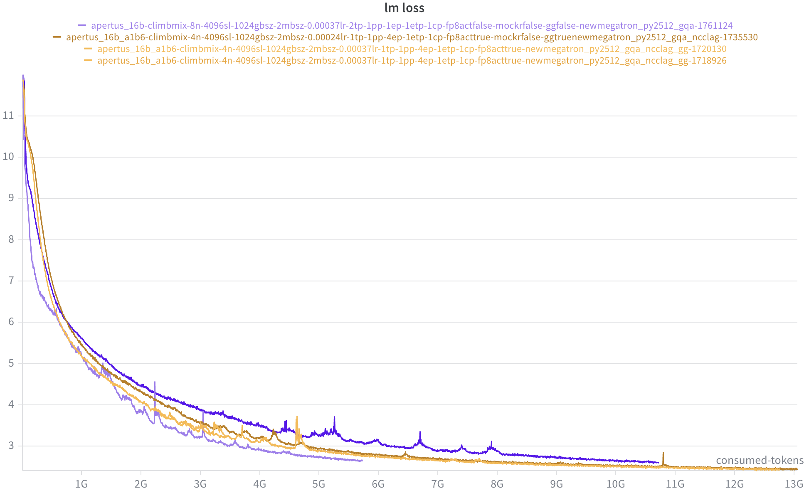
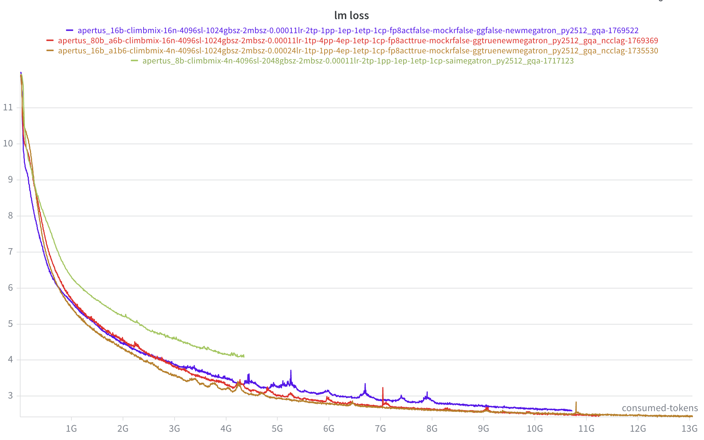
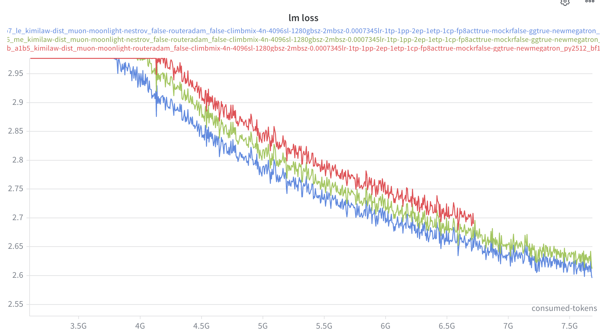
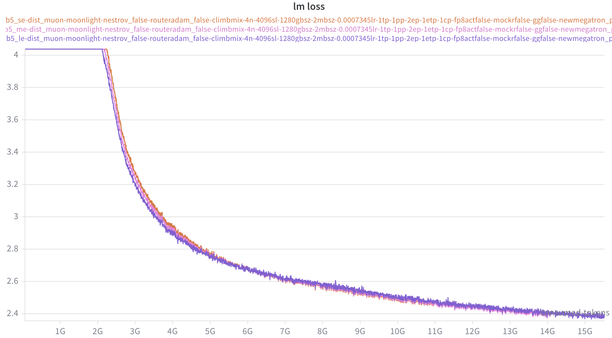

# Dense to MoE model ablation experiments

The baseline MoE experiments with Qwen3-30B-A3B is kind of in a mess due to all kinds of problems in Megatron and the low training throughputs. Also, it is not so clear for me how should we utilize this baseline model. Hence, I want to slightly switch the gear with the following roadmap:

- **For the original Qwen3-30B-A3B experiments:**

  - Continue the experiment but with a focus more on the performance side. 

- **For the exploration of MoE model:**

  I want to follow the prior works to understand and verify the scaling law for MoE models. 

  - A dense model (Apertus -8B or Qwen3-8B). The dense model will be used to verify the MFU/loss.
  - A comparable MoE model using the scaling law from the prior work. The MoE model will be configured carefully, and to see if it can surpass the dense baseline. 

## Theoratical analysis

1. Define MoE vs Dense in terms of FLOPs

2. MoE consumes less computation while maintains a larger model size

3. Given a 8B dense model size, when will a MoE model surpass it?

   - **Comparison Criteria**

     - LM loss: should be the easiest to observe.
     - Downstream task

   - **Fixed compute budget $C$:** 

     
     $$
     \begin{align}
     & M = 6\Phi_{comp}\\
     & C = M\cdot D
     \end{align}
     $$
     

     where $\Phi_{comp}$ is the parameter size that involved in computation, $M$ is the computational cost per token and $D$ is the number of tokens. A typical approach in ablations woule be using a fixed compute budget for MoE and dense models. Assume a **fixed compute budget of $10^{21}$ FLOPs**, with 8B dense model and 30B-A3B MoE model. We have the following estimations:

     - $D_{dense} = \frac{10^{21}}{6\cdot8e9} = 21B$, $D_{moe} = \frac{10^{21}}{6\cdot3e9} = 56B$

   - **Fixed wall time $T$:** 

     The calculations above give approximations based on fixed $C$. In practice, even though MoE requires lower computations, the throughput does not match expecations. By testing, we have practical token throughputs given 16GPUs for 8B dense model and 30B-A3B MoE model: 

     - $t_{dense} = 99620\ \rm{tokens/s}$, $t_{moe} = 137600\ \rm{tokens/s}$
     - $T_{dense} = \frac{21B}{99260} = 58h$, $T_{moe} = \frac{56B}{137600}=113h$

     As we can see, MoE model requires almost twice of the training time using our current training framework compared to the dense model given the same compute budget. It matches the MFU observed: ~$41$% for dense and ~$20$% for MoE. Then what if we **fix the training wall time $T$ to 12h:**

     - $C_{dense}= 6\cdot 8e9\cdot t_{dense} \cdot 12h$ = $2\cdot 10^{20}$ FLOPs, $C_{moe} = 6\cdot 3e9 \cdot t_{moe} \cdot 12h$ = $10^{20}$ FLOPs
     - $D_{dense} = 4.2B$, $D_{moe} = 5.6B$

## Dense to MoE experiments

Prior work declares that: *an MoE model with a 3.1% activation ratio and an expert granularity of 12 will achieve **over 7x computational efficiency** under a 1e22 FLOPs compute budget*. 

### Setup

- **Dense model**: 

  - Apertus-8B with SwiGLU and Adam ([link](https://github.com/swiss-ai/pretrain-code/blob/main/pretraining/submit_apertus_8b.sh))

  - ###### 16 nodes, GBS2048, TP2, LR1.1e-4, seqlen4096

- ##### **MoE model**: 

  ```
  --num-layers 20
  --hidden-size 2048
  --ffn-hidden-size 5120
  --moe-ffn-hidden-size 512
  --moe-shared-expert-intermediate-size 512
  --num-experts 256
  --moe-router-topk 12
  --ep 4
  --mbs 2
  --seql 4096
  ```

  - 16B-1.6B with SwiGLU and Adam, Non-embd Activated parameter = 1.07B
  - $A = \frac{12 + 1}{256+1} = 5.05\%$, $G = \frac{2\cdot 2048}{512} = 8$
  - 16 nodes, GBS1024, EP4, LR3.3e-4, seqlen4096

- **Compute Budget**

  - $\frac{M_{dense}}{M_{moe}} = 5$, it is less than the declaration but should be good for verification
  - If we fix $C = 10^{21}$FLOPs: 
    - $D_{dense} = 21B$, $D_{moe} = 104B$
    - $T_{dense} = \frac{21B}{99260} = 58h$, $T_{moe} = \frac{104B}{300800}=96h$
  - If we fix $T = 12h$
    - $C_{dense} $ = $2\cdot 10^{20}$ FLOPs, $C_{moe} = 6\cdot 1.6e9 \cdot 300800 \cdot 12h$ = $1.2\cdot 10^{20}$ FLOPs
    - $D_{dense} = 4.2B$, $D_{moe} = 12.5B$

- **What to expect?**

  Given the current settings, we want to see: 

  - Will MoE model's loss surpass Dense model?
  - If so, can this MoE model do better in loss? (Stable + Faster)
  - Otherwise, how to modify the MoE model?

### Experiments 1

- After the first 12h:


- Based in what is observed:
  - 16B-1.6B MoE model surpasses 8B dense model within the same amount of tokens
  - As MoE model has a higher token throughput, MoE model is trained with more tokens
  - Dense MFU (40%) is higher than MoE MFU (18%)
- As shown below, 
  - **with different LR and GBS, 16B-1.6B MoE models still surpass 8B dense model**



### Experiments 2

The better performance in lm loss can result from:

- 16B-1.6B MoE model has a larger total parameter size then 8B dense model

Then:

- With a dense model of similar total parameter size (16B dense), can it achieve similar performance in loss
- With an MoE model that has similar token throughput to 16B dense model, will it surpass the 16B dense model

#### Exp Setup

- **Dense Model**: 16B Dense

  ```
  --num-layers 44
  --hidden-size 5120
  --ffn-hidden-size 17408
  --num-attention-heads 40
  --num-query-groups 8
  --tp 2
  --mbs 2
  --seql 4096
  ```

- **MoE Model**: 

  - In our training infra, $\frac{MFU_{dense}}{MFU_{moe}}=2.2$. Given 16B computational parameter for dense model, MoE model will need roughly $\frac{16B}{2.2} = 7.2B$ for activated parameter. 
  - By configuration, I setup a 80B-A6B MoE model (it is hard to setup a A7B MoE model while maintain a reasonable activation ratio/total model size)

  ```
  --num-layers 32
  --hidden-size 3072
  --ffn-hidden-size 9216
  --moe-ffn-hidden-size 1024
  --moe-shared-expert-intermediate-size 1024
  --num-experts 256
  --moe-router-topk 14
  --ep 4
  --pp 4
  --mbs 2
  --seql 4096
  ```

#### Exp 29/03/2026

1. **Dense-16B vs. MoE-80B-A6B**, 

   - **GBS2048, LR1.1e-4**

   - **Token Throughput**: $t_{dense16b}=4200\rm{token/sec/gpu}$, $t_{moe80ba6b}=5200\rm{token/sec/gpu}$

   


#### Exp 30/03/2026

1. **MoE-80B-A6B with varing configs**



2. **Dense-16B with varing configs**

   

3. **Dense-16B vs. MoE-80B-A6B**

   - Purple for Dense and Red for MoE
   - For all configs, MoE would surpass Dense at different points

   

5. **Dense-16B vs. MoE-16B-A1.6B**

   - All with GBS1024. Varing LR
   - Dense-16B and MoE-16B-A1.6B are **at least comparable** 
     - Dense-16B has the trend to surpass MoE

   

6. **Dense-8B + MoE-16B-A1.6B vs. Dense-16B + MoE-80B-A6B**

   - Start with the stable run that is less spiky for each model.

   - The general trend is: MoE-80B-A6B > MoE-16B-1.6B ~ Dense-16B > Dense-8B
     - This is what we are expecting
     - But we **cannot draw a solid conclusion within 10B tokens**
       - An estimation of token budget might be **~15B-20B** to find clear signal



5. **Dense-8B + MoE-16B-A1.6B vs. Dense-16B + MoE-80B-A6B**
   - Let's check more configurations [[link](https://wandb.ai/fuguan323-ethz/dense_to_moe_ablation/panel/l8i2031v8?nw=nwuserfuguan323)]


# MoE Model Ablations

Reference

## Theoratical Analysis

We define something that we want to check. 

- **Expert Granularity:** it is a measurement of how fine-grained the MoE layer is. Defined as $G=\frac{d_{model}}{d_{expert}}$

  1. The common trend is to have fine-grained MoE layer. For instance, DeepSeek-V3 has $G = 7168/2048 =3.5$ and Qwen-3.5 has $G = 4096/1024 =4$. Some works [[ling](https://arxiv.org/abs/2507.17702v4), ] also indicate that larger G is better, and the optimal G is between 4 - 6. 

  2. But the problem is, a smaller G is better for our infrastructure. Large expert can enable a higher training throughput when activated parameter size is the same.

## MoE Expert Granularity Ablations 

### Setup

- **MoE-7B-A1.5B** with varying expert granularity 
  - Megatron cannot define shared expert number. In this case, corse-grained MoE will have a slightly large activated parameter size.

```
"hidden_size": 2048,
"moe_intermediate_size": 512/1024/2048,
"num_hidden_layers": 16,
"num_experts": 128/64/32,
"num_experts_per_tok": 16/8/4,
"shared_expert": 1,
```

- 4 nodes with EP2
- GBS1280, LR7.3e-4, Muon Optimizer

### Throughput Comparison

| Model           | Throughput         |
| --------------- | ------------------ |
| MoE-7B-A1.5B-se | 20600 tokens/s/gpu |
| MoE-7B-A1.5B-me | 26660 tokens/s/gpu |
| MoE-7B-A1.5B-le | 28261 tokens/s/gpu |

### Exp 08/04/2026

- Red: G=4, Green: G=2, Blue: G=1
- Single Expert weight.
- Within 6.5B, corse-grained MoE has the lowest loss. It is against the common trend. 



### Exp 09/04/2026

- Disable shared expert to guarantee exactly same activated parameter size.

### Exp10/04/2026

- Use shared expert of the same size to guarantee exactly same activated parameter size.
- Split Expert weight.



### Exp 10/04/2026

- Use Adam instead of Muon.
- GBS2048, LR3.5e-4


