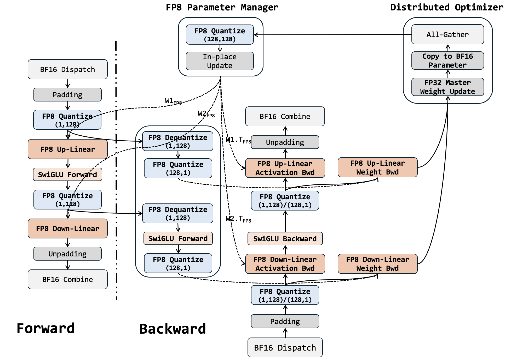
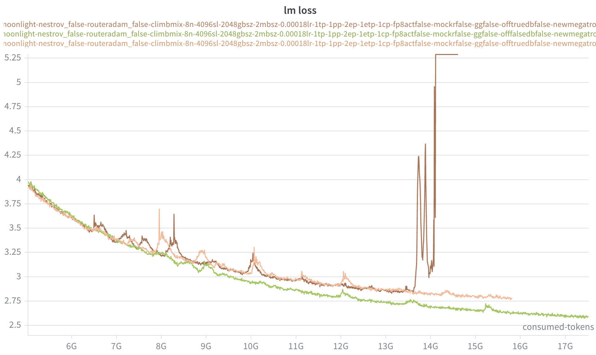
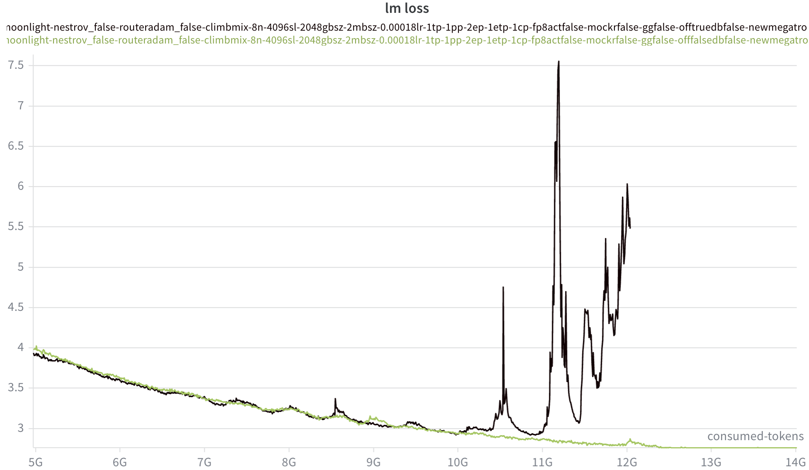
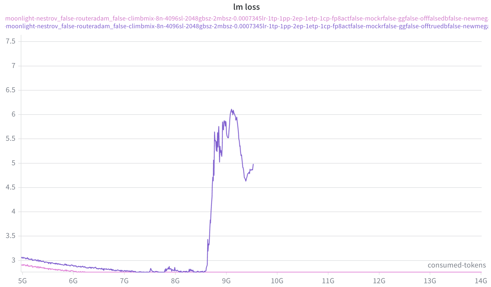
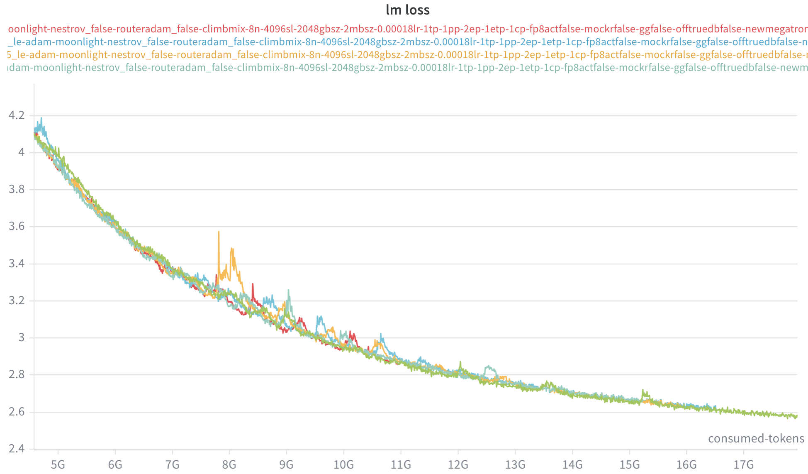
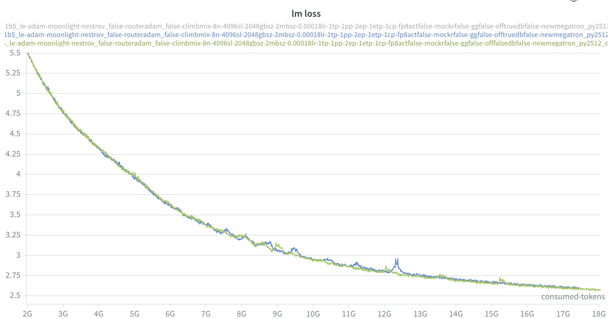

# Offload Experts with FP8 support in Megatron

As we have built in offload-experts.md, it is verified to be practical offload experts into CPU RAM while hide the H2D loading with computation. 

In a next step, FP8 support should be included into the roadmap. 

## Theoratical Analysis

### FP8 Recipe

DeepSeek recipe:

| Model Weight Quantization | Activation Quantization | FP8 Dtype   | SF Dtype |
| ------------------------- | ----------------------- | ----------- | -------- |
| (128, 128)                | (1, 128) / (128, 1)     | float8_e4m3 | float32  |

- Let input be a **standard Gaussian distributed tensor with N(0, 1)**
- L2 Diff = $\frac{Norm(T - T_{ref})}{Norm(T_{ref})}$

| FP8 Operation                                        | Relative Error |
| ---------------------------------------------------- | -------------- |
| (1, 128) quantization                                | ~2.52%         |
| (128, 128) quantization                              | ~2.73%         |
| $x_{bf16} = a_{(1,128),fp8} \cdot b_{(128,128),fp8}$ | ~3.70%         |


| FP8 FWD + BWD                       | Relative Error |
| :---------------------------------- | -------------- |
| $a = x \cdot W_1$                   | ~3.70%         |
| $s = swiglu(a)$                     | ~5.26%         |
| $y = s \cdot W_2$                   | ~6.33%         |
| $da = swiglu_{bwd}(dy \cdot W_2^T)$ | ~6.89%         |
| $dx = da \cdot W_1^T$               | ~6.89%         |
| $dw2$                               | ~7.70%         |
| $dw1$                               | ~7.70%         |


### Loading-Computation Overlap Efficiency

The same analysis can be applied. With half model weights (FP8) and double computational TFLOPs (FP8), we should have the same conclusion on optimal token number $M$.

## Implementation in Megatron

### General Design



FP8 implementations will be tricky. 

For now only TransformerEngine provides solution for FP8 computation in MoE and Attention layer, however to support offloading in MoE it will hard to hack TE code. It is a relatively easier approach to implement our own autograd function with FP8 support for MLP. The roadmap is:

1. **FP8 MoE**: `experts_fp8_util.py`

   It is the reference implementation without offloading.

   - **MLP:** `ExpertsFP8GroupedSwiMLP`
   - **Parameter:** `FP8GPUExpertsParameterManager`

2. **FP8 MoE with Expert Offloading**: `experts_offloading_fp8_util.py`

   - **MLP**: `OffloadingExpertsFP8GroupedSwiMLP`

     - **FP8 GroupGEMM**: DeepGEMM
       - Forward and Activation Backward: `m_grouped_fp8_gemm_nt_contiguous`

       - Weight Backward: `k_grouped_fp8_gemm_nt_contiguous`

     - **FP8 Quantizations**: triton kernels `fp8_jit.py`
       - per_block_cast (128, 128): for weight

       - per_token_cast (1, 128): for forward activation

       - per_channel_cast (128, 1): for backward activation

     - **Loading-Computation Pipieline**: same as `OffloadingExpertsGroupedSwiMLP`

   - **Parameter**: `FP8ExpertsParameterManager`

     Expert parameters are stored on CPU RAM. Megatron DDP manages the allocation of parameter tensor. Coupled with complex buckets and overlapping logic, it is not ideal to aggressively modify existing DDP codes. Hence, `FP8ExpertsParameterManager` is designed as an extra state manager to control the behavior of FP8 weights quantization and access.

     - **Allocated** as BF16 buffers.
       - Megatron DDP handles the allocation of BF16 Parameter on CPU
       - `FP8ExpertsParameterManager` uses `.data_ptr()` to record expert parameter tensor storage.
     - **Quantized** after all-gather or before first micro-batch computation in each iteration. These are 2 different approaches. The first is the ideal one to avoid prolonging PP bubble, but difficult in practice. For now `FP8ExpertsParameterManager` takes the second approach.
       1. Upon all-gather the BF16 tensors stay on GPU, and can be directly quantized into FP8 tensors before copying to CPU. Expert parameters are stored in the same bucket group, when the bucket group finishes param_sync, params in the group can be marked for quantization. 
       2. Upon the first micro-batch computation, all BF16 parameters have been updated by optimizer. When they are first accessed, re-quantize them.
          - `FP8ExpertsParameterManager` should be aware of `is_first_mircobatch` to mark when requantization should happen.
          - `FP8ExpertsParameterManager` will handle quantization through an unified interface:
            1. **H2D Copy**: copy updated CPU parameter into GPU buffer
            2. **Quantization**: perform quantization on GPU
            3. **D2H Copy**: **<u>reuse</u>** existing BF16 buffer to save quantized parameter

### TODOs

- [x] **General design** (@fuguan)
  - [x] DeepGEMM integration and unit tests `moe/utils.py`
  - [x] Quantization kernels and unit tests `moe/fp8_jit.py`
  - [x] Forward and Backward pass with/without offloading, and unit tests `moe/experts_offloading_fp8_util.py`
  - [x] ExpertParamManager and In-place FP8 support `FP8ExpertsParameterManager`
- [ ] **Checkpoint saving** (@fuguan)
  - With `FP8ExpertsParameterManager`, the BF16 tensor storage is replaced with quantized FP8 parameter. In this case, we cannot directly save checkpoints using parameter tensor. 
- [x] **Support activation recomputation in MoE layer**
- [ ] **Muon optimizer with separate expert update**
  - With FP8 and Experts offloading, we allocate all experts with a single tensor such that we can have access to main_grad as a contiguous tensor. However, it will cause problem for Muon update, which requires a more granular approach to handle the individual expert parameters.
- [ ] **Verify functionality and correctness with VPP**
  - Different PP scheduler functiosns have `first_micro_batch` flag to indicate when the iteration starts
- [ ] **FP8 projection for attention block**
  - TransformerEngine provides FP8 support for linear layer in attention block. We could either make TE FP8 linear layer work with our FP8 MoE layer, or design our own FP8 linear layer.
- [ ] **Support `delay-wgrad-compute` in `OffloadingExpertsFP8GroupedMLP`**
- [ ] **Refactor codebase**
  - Some functionalities like triton kernels should be maintained in an separate library
  - Some part of the code is hard-coded, i.e. the shape of weight or output tensors
- [ ] **Quantization triton kernel optimization (optional)**
- [ ] 

## Implementation Log

#### 07/05/2026 Unit tests

- Added unit tests for DeepGEMM

#### 06/05/2026 Forward + Backward Passes

- Implemented Forward + Backward Pass
- Added unit tests for layer-level forward and backward

#### 09/05/2026 Loss Deviation

- Correctness verification with MoE-7B-1.6B
- Loss deviates and crashes after ~8B tokens.



#### 10/05/2026 Loss Deviation Cont'd

- Launch FP8 training without offloading using both Adam and Muon
- Both crashed after ~10B tokens
  - This sudden crash does not look like an implementation error. It seems to be a data point that crashes the training.





#### 11/05/2026 Loss Deviation Cont'd

- Launch FP8 training: 

  | Training Setup                                 | Result   |
  | ---------------------------------------------- | -------- |
  | FP8 Fwd + BF16 Bwd                             | No Crash |
  | FP8 Fwd + BF16 Dgrad + FP8 Wgrad               | No Crash |
  | FP8 Fwd + FP8 Dgrad + BF16 Wgrad               | No Crash |
  | FP8 Fwd + (FP8 Agrad + BF16 Xgrad) + FP8 Wgrad | Crashed  |

- The loss does not crash. There are spikes, but it should be normal with Adam.
  - There might be 2 causes:
    - Numerical instability caused by FP8 training.
    - Implementation problem that is triggered by unnormal logit.



#### 12/05/2026 Loss Deviation Cont'd

- Add monitors for grad_a and grad_x computation in backward pass.
  - grad_a presents reasonable relative error (~3.3%)
  - **<u>grad_x presents relative error that is too high (>= 17%)</u>**
    - dx = **<u>cast(da)</u>** * cast(W1.T)
    - Given that grad_a presents low error rate, the problem might be in the cast kernels.

```
25: [rank25]:   File "/capstor/scratch/cscs/gfu/frameworks/Megatron-LM/megatron/core/transformer/moe/experts_fp8_util.py", line 656, in backward
25: [rank25]:     assert d < 0.20, f"grad_x diff norm {d:.2e} exceeds threshold"
25: [rank25]:            ^^^^^^^^
25: [rank25]: AssertionError: grad_x diff norm 2.00e-01 exceeds threshold
```

- Inspection in quantization kernel

  Claude adds an **<u>epsilon value of 1e-4 that bounds the min maximum in a vector</u>**. It will cause problem if the tensor to be quantized contains really small values.

  - `x_amax = tl.maximum(x_amax, 1e-4)`

  After disabling epsilon value, the error of grad_x drops into normal range (~3.5%)

- Verification (Blue for FP8):
  - The training does not crash.

