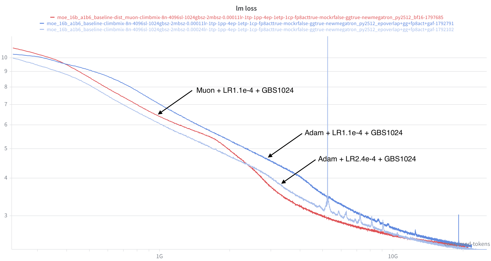
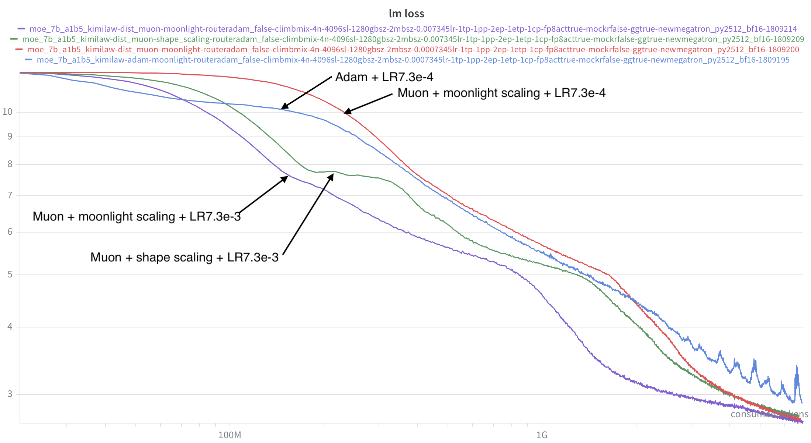
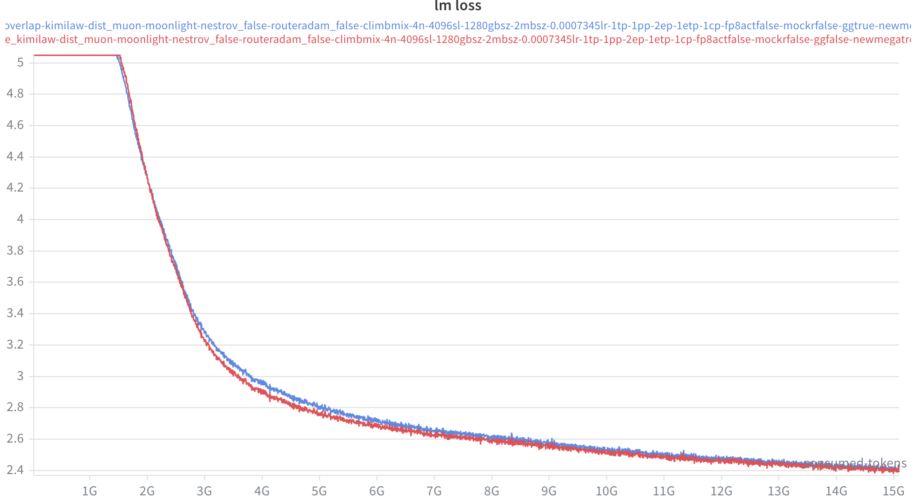
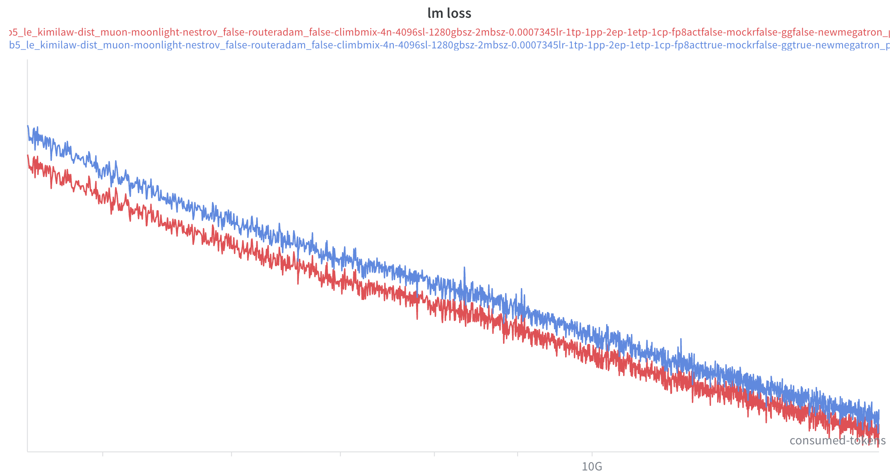
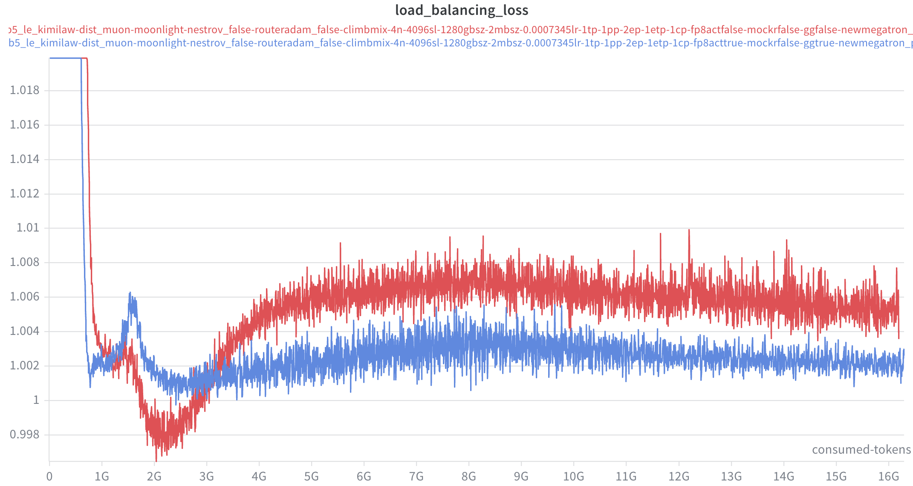
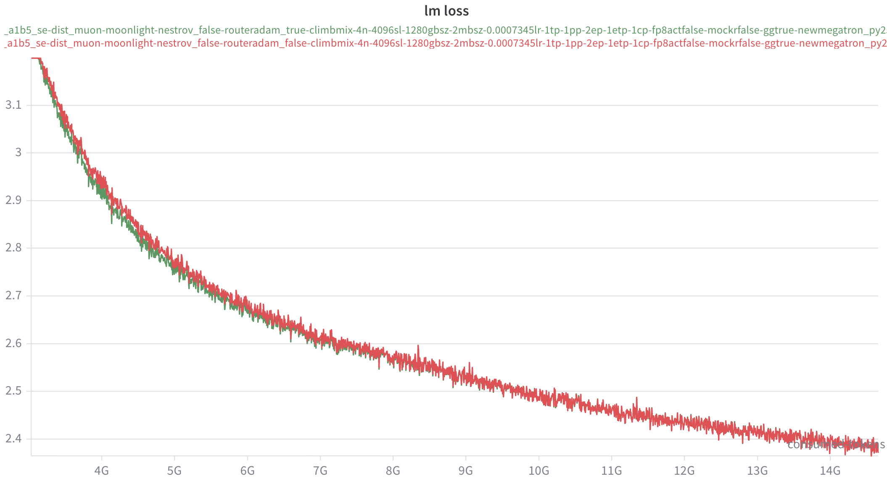
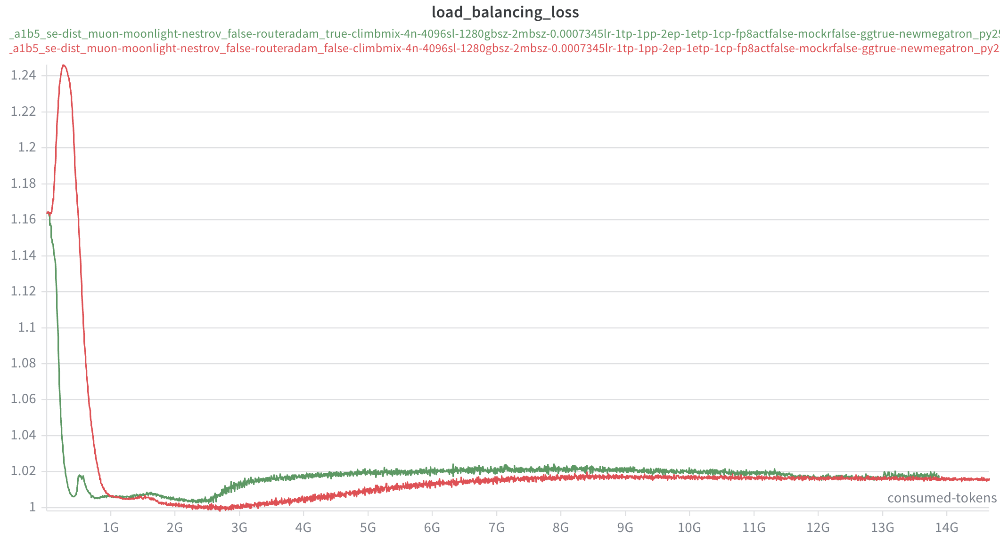
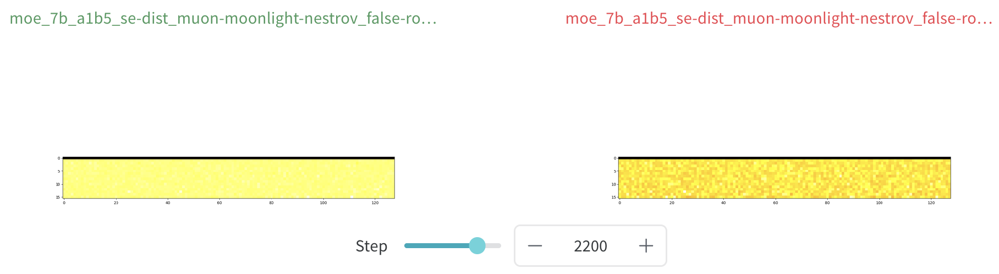

# Optimizer Ablation Experiments

We mainly consider 2 optimizers for now: Adam and Muon.

**Adam:**
$$
\begin{align*}
& M_t = \beta_1M_{t-1} + (1-\beta_1)G_t \\
& V_t = \beta_2V_{t-1} + (1-\beta_2)G_t^2 \\
& W_t = W_{t-1} - \frac{\eta}{\sqrt{V_t} + \epsilon}(M_t + \lambda W_{t-1})
\end{align*}
$$
**Muon:**
$$
\begin{align*}
& M_t = \beta M_{t-1} + G_t \\
& W_t = \begin{cases}

& W_{t-1} - \eta_t ({\rm msign}(M_t) +\lambda W_{t-1}), & \rm{Naive} \\

& W_{t-1} - \eta_t (\sqrt{{\rm max}(1, d_{out}/d_{in})}{\rm msign}(M_t) +\lambda W_{t-1}), & \rm{KellerJordan} \\

& W_{t-1} - \eta_t (\sqrt{ d_{out}/d_{in}}{\rm msign}(M_t) +\lambda W_{t-1}), & \rm{MuP} \\

& W_{t-1} - \eta_t (\sqrt{{\rm max}(d_{out}, d_{in})}{\rm msign}(M_t) +\lambda W_{t-1}), & \rm{Spectral} \\

& W_{t-1} - \eta_t (0.2 \times \sqrt{{\rm max}(d_{out}, d_{in})}{\rm msign}(M_t) +\lambda W_{t-1}), & \rm{Moonlight}

\end{cases}

\end{align*}
$$

## Adam to Muon Ablations

First we want to see how is Muon better than Adam.

### Setup

- **MoE-7B-A1.5B-se**
  - 4 nodes, EP2

### Exp 06/04/2026

- GBS1024 + LR1.1e-4
- Muon is much more stable

## Muon LR/Scaling Factor Ablations

Muon has different versions of implementations, where mainly the scaling factor varies. The important thing is how do they diff and how should the hyper-parameter set.

### Setup

- **MoE-7B-A1.5B-se**
  - 4 nodes, EP2
  - KimiLaw to determine LR and GBS: GBS1280, LR7.3e-4

### Exp 07/04/2026

- Scale LR by 10x for 'shape_scaling'

## Muon on Split Expert Weights

Muon performs differently depending on how the expert weights are allocated. In Megatron, we can either allocate experts as a big tensor: $(N_{le}\cdot d_{moe}, d_{model})$ or allocate separately: $N_{le} \cdot (d_{moe}, d_{model})$ where $N_{le}$ stands for number of local experts.

- The first case makes the expert weight a large rectangular matrix: $\frac{N_e d_{moe}}{d_{model}} = kN_{le} $, which implies that the optimizer update can vary with EP size and it is not ideal.  
- While the second case makes the weight more square: $\frac{d_{moe}}{d_{model}} = k$. 

As Muon uses orthogonalization on the while matrix, the split weights should be the correct scenario for Muon to work best. But we want to see if it indees makes a difference.

### Exp 11/04/2026

- **MoE-7B-A1.5B-le**
  - 4 nodes, EP2, GBS1280, LR7.3e-4, Moonlight scaling
  - $k = 1$, $N_{le} = 16$
  - Split (Red) vs. Single (Blue) Expert weight
- **Observations**
  - Split (Red) and Single (Blue) have close LM loss. Split is slightly better.
  - Single (Blue) has a lower load balancing loss. 

## Mixed Muon + Adam Ablations

Router weight is a rectangular weight of shape $(d_{model},N_e)$  with $d/N = [8-16]$. It has similar implications with split experts weight. 

### Exp 13/04/2026

- **MoE-7B-A1.5B-se**
  - Use Adam for router (Green) vs. Muon (Red) for router
  - Split expert weights for both.
  - $d/N = 2048/128 =16$
    - Kimi-K2 has a shape of $d/N = 7168/384 = 18.6$
  - 4 nodes, EP2, GBS1280, L7.3e-4, Moonlight scaling
- **Observations**
  - Both have almost identical LM loss
  - With Adam, LBL loss is **<u>higher</u>**. 
    - But with Adam, all the experts in each layer will be trained with similar number of tokens (more balanced in terms of trained tokens for experts). 
    - Compared to use Adam for all, router with Adam has a much more stable LBL loss. 

460GB = W_e + G_e + O_e = 5 * W_e

W_e = L * W, W = 460/5/20 = 4.6GB/layer

e = 4.6/128 =0.0359 GB/expert

d = 7168, d_e = 2048, e = d*d_e

### Exp 14/04/2026

- **MoE-7B-A1.5B-le**
  - Use Adam for router (Green) vs. Muon (Red) for router
  - Split expert weights for both.
  - $d/N = 2048/32 =64$. The router has a **<u>much more rectangular</u>** shape compared to MoE-7B-A1.5B-se
  - 4 nodes, EP2, GBS1280, L7.3e-4, Moonlight scaling