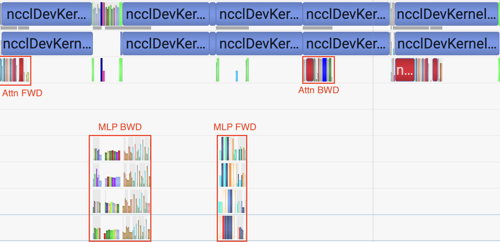
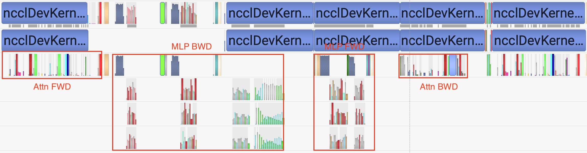
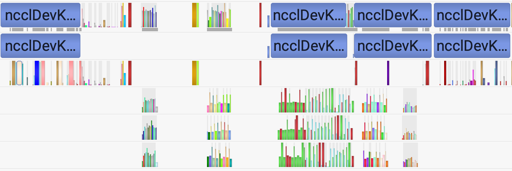

# Why offloading experts matter?

The GH200 cluster we have suffers from slingshot bandwidth, which makes inter-node EP communication slow. At this stage, we have roughly **25GB/s** inter-node All-to-All bandwidth after NCCL env var fixes, which hits the boundary of our network for now. The points I want to clarify and discuss are: 

- **Is 25GB/s good enough to train a large MoE model at scale?**
- **Is offloading experts necessary?**

## Preliminary

We define the following symbols for an MoE model:

| Symbol | Def                                                          |
| ------ | ------------------------------------------------------------ |
| $N_e$  | Total number of routed experts                               |
| $N_a$  | Activated routed experts per token                           |
| $H$    | Hidden size of model                                         |
| $h_e$  | Intermediate size of expert                                  |
| $L$    | Hidden layers                                                |
| $C$    | Chunk size (number of experts) for loading                   |
| $M$    | Number of tokens assigned to each expert in balanced scenario |

And the following for parallel strategy:

| Symbol    | Def                                     |
| --------- | --------------------------------------- |
| $N_{gpu}$ | World size                              |
| $DP$      | $\frac{N_{gpu}}{TP \cdot PP}$           |
| $EDP$     | $\frac{N_{gpu}}{EP \cdot PP \cdot ETP}$ |

And we have the following formula:

1. $M = \frac{mbs\cdot seq \cdot N_a}{N_e} \cdot \frac{DP}{EDP} = mbs\cdot seq \cdot \frac{EP}{TP}\cdot \frac{N_a}{N_e}$ 

## Expert Parallel

In our hardware, we have the following ways of doing EP communication:

1. **NCCL + All-Gather**

2. **NCCL + All-to-All**

A simple comparion between these 2 methods:

|                 | All-Gather                              | All-to-All                                |
| --------------- | --------------------------------------- | ----------------------------------------- |
| **Peak Memory** | $2 \cdot EP \cdot seq\cdot mbs \cdot H$ | $2 \cdot N_a \cdot seq \cdot mbs \cdot H$ |
| **Scales with** | $EP$                                    | $N_a$                                     |

The math might not be rigorous, but for MoE training at large scale, All-Gather is not memory efficient.

### Implications of Large EP

As built in Preliminary section, the number of tokens assigned to each expert is related to EP. Hence the implications of large EP are:

1. **Reduce** expert weight memory consumption $\rarr$ lower memory pressure
2. **Increase** per-expert problem size $\rarr$ better hardware utilizations
3. **Increase** EP communication size and range $\rarr$ longer A2A communication

Large EP size hence brings the opportunity for perfect communication-computation overlap. In Megatron, it is called expert-parallel-overlap:


With properly fine-tuned scheduleing plan and carefully configured MoE setup, there are spaces to achieve ideal overlapping at the cost of higher memory consumption. 

## EP Overlap vs. MoE Offloading

EP overlap seems to be a nice approach to mitigate the high All-to-All latency. But can we find the balanced point that can achieve a perfect overlap? 

Before answering this question, a point that we should build is what brings accleleration under the scenario of communication-computation overlapping:

1. The acceleration of **exposed** computations if computation dominates
2. The decreased communication **volume** or increased communication **bandwidth** if communication dominates

For this purpose, I configured a **46B-A4B** MoE model to test on **32-GPU** scale. 

```yaml
model='MoE-46B-A4B'

# general config
NUM_LAYERS=4
HIDDEN_SIZE=4096
FFN_HIDDEN_SIZE=16384
NUM_ATTENTION_HEADS=128
NUM_QUERY_GROUPS=128

# moe config
MOE_LAYER_FREQ='\([1]*4\)'
MOE_FFN_HIDDEN_SIZE=2048
MOE_SHARED_FFN_HIDDEN_SIZE=2048
NUM_EXPERTS=448
TOPK=28
```

Based on this model, I setup 3 model configurations that only differ in $N_a$:

| Model       | $N_a$ | Activation Ratio |
| ----------- | ----- | ---------------- |
| MoE-46B-A2B | 14    | 3.125%           |
| MoE-46B-A4B | 28    | 6.25%            |
| MoE-46B-A7B | 56    | 12.5%            |

They are not nicely-look MoE models. The design of this model is to 'simulate' a chunk of a large MoE model under pipeline parallel *(it cannot really simulate because of the in-flight micro-batch number and ZeRO-1 sharding)*, and saturate GPU memory with EP4-TP4 setup. Hence, the model can only be trained with inter-node EP without offloading support.

I launched different performance tests with varied setup:

**MoE-46B-A2B:**

|                                     | **Throughput (tokens/s/gpu)** | **Memory** |  **MFU**  |
| ----------------------------------- | :---------------------------: | :--------: | :-------: |
| FP8 MoE + EP4-TP4 + MoE Offloading* |             12000             |    84%     |   17.2%   |
| **BF16 + EP8-TP4 + EP Overlap**     |           **16100**           | **75.2%**  | **23.3%** |
| BF16 + EP16-TP4 + EP Overlap        |             10900             |   59.0%    |   15.8%   |

**MoE-46B-A4B:**

|                                         | Throughput (tokens/s/gpu) |  Memory   |    MFU    |
| --------------------------------------- | :-----------------------: | :-------: | :-------: |
| BF16 + EP4-TP4                          |             -             |    OOM    |     -     |
| BF16 + EP4-TP4 + MoE Offloading         |           8700            |   92.3%   |   20.6%   |
| **FP8 MoE + EP4-TP4 + MoE Offloading*** |         **10000**         | **85.7%** | **23.0%** |
| BF16 + EP8-TP4                          |           6830            |   71.2%   |   15.7%   |
| **BF16 + EP8-TP4 + EP Overlap**         |         **9400**          | **82.3%** | **21.7%** |
| FP8 + EP8-TP4 + EP Overlap              |           9450            | 81.0% (?) |   21.8%   |
| BF16 + EP16-TP4 + EP Overlap            |           5790            |   65.5%   |   13.3%   |

**MoE-46B-A7B:**

|                                         | Throughput (tokens/s/gpu) |  Memory   |    MFU    |
| --------------------------------------- | :-----------------------: | :-------: | :-------: |
| **FP8 MoE + EP4-TP4 + MoE Offloading*** |         **7400**          | **94.8%** | **29.7%** |
| BF16 + EP8-TP4 + EP Overlap             |           5100            |   97.0%   |   20.8%   |
| BF16 + EP16-TP4 + EP Overlap            |             -             |     -     |     -     |

> *NOTE: with FP8 MoE the computations are in FP8 for MLP and the activations in MoE layer are stored in FP8, which saves activation memory. 

A fair point to argue is that PP is not introduced here, and the results might not be well extended to large scale with VPP. This will be discussed later. But for performance comparison: 

- VPP is inter-device overlapping scheme, which does not interfere with EP overlap.
- MoE offloading does not touch logics for VPP scheduling, and hence does not interfere with pipeline communications.

### Insights from result and profile

#### 1. Large EP and EP Overlap

1. **Does EP Overlap work well?**
   - From the number: it brings performance boost.
   - From the profile: computations and communications are overlapping exactly as depicted in the figure.

2. **Does larger EP help?**

   - From the number: **NO**, EP16 presents significant performance degradation at this scale for all the models, and we should not expect it to perform well at larger scale.

   - From the profile of **MoE-46B-A4B**

     - EP16 (All-to-All across 4 nodes) is **completely** **communication dominated**
     - The increase in per-expert computation problem size fail to mitigate with the increase in EP communication

     

3. **Does FP8 help with EP Overlap?**

   - From the number: **NO**, FP8 acclerates the training with only minor amount.

   - From the profile of **MoE-46B-A4B**:

     - EP8 (All-to-All across 2 nodes) is still **communication dominated**. FP8 brings computation accelerations and quantization overheads, which don't actually contribute to the end-to-end performance under the overlapping scenario. 
     - The sub-optimal implementations with TransformerEngine bring unnecessary overheads, and for some unknown reasons TE implementation does not reduce memory usage. 

     

4. **Will larger model size help?**
   - Though I did not conduct such a test, the answer would probably be **NO**.
     - Larger model size means larger communicational volume and larger computational size at the same time

5. **Will larger $N_a$ help?**

   - **NO**. Check **MoE-46B-A7B**, a large activation ratio does not help with MFU.

6. **Will smaller $N_a$ help?**

   - With current model size and expert granularity, **smaller $N_a$ achieves the best performance at EP8**.

   - From the profile, **MoE-46B-A2B** has **perfect overlapping** when balanced

     - In this case, FP8 would help with exposed computations.

     

7. **How to optimize for larger EP?**

   - Reduce communication volume when bandwidth is fixed
     - NCCL has suppotted FP8 for non-reductive operations since v2.28 ([link](https://github.com/NVIDIA/nccl/releases/tag/v2.28.3-1)). However, whether FP8 p2p communication is available or stable is unknown.  
   - Increase computation intensity such that it covers the communication cost
     - Hard to configure a reasonable model. Increasing model size or $N_a$ will both increase computation size and communication volume. 

#### 2. Large EP and MoE offloading

1. **When does MoE offloading help?**

   - As discussed in expert offloading, the load-computation overlap efficiency matters, and it only benefits with large actiation ratio. 

     - $\rm{Overlap Efficiency =}\frac{T_{gemm}}{T_{load}} = M \cdot\frac{450}{989e3}$, where $M$ is related to EP, TP and $N_a/N_e$ (activation ratio). 

     - For **MoE-46B-A2B:** Offloading is **much slower** than EP8 + EP Overlap because of the small activation ratio. 
     - For **MoE-46B-A4B:** Offloading is **6.3% faster** than EP8 + EP Overlap with 3.4% more memory consumption. 
     - For **MoE-46B-A7B:** Offloading is **40% fater** than EP8 + EP Overlap. 

   - Hence, **at this scale, EP8 + EP Overlap for MoE-46B-A2B is the best approach to go with**. 

2. **Is EP8 + EP Overlap the answer for large MoE training?**

   - To answer this question, we need to clarify what are missing in the experiments above:

     - Large number of In-flight micro-batches for VPP $\rarr$ increase activation memory
     - ZeRO-1 sharding of optimizer states $\rarr$ reduce weight memory

   - However, in large scale training with multiple PP stages, **activation memory takes the majority**.

     - **Peak in-flight micro-batch number = (*pp* - *rank* - 1) * 2 + (*vpp* - 1) * *pp* + 1**

   - We can roughly **estimate** the peak memory consumption at large scale with VPP

     - The estimation is not accurate, with -6% to +6% errors.
     - **Model**: MoE-344B-A40B ([link](https://github.com/swiss-ai/cluster-health-tests/pull/6)) + Muon + Block-wise FP8

     - **Parallelism**: WORLD=4096 TP=4 PP=16 VPP=2 **EP=32** DP=64 EDP=8
     - **MBS = 2**, Sequence Length = 4096

   ```
   ============================================================
    Total Parameters: 346.41B | Activated Parameters: 39.89B
    Parallelism: WORLD=4096 TP=4 PP=16 VPP=2 EP=32 DP=64 EDP=8
    Layout: Et|(tt|)*30L
    Schedule: 1F1B-Interleaved
   ------------------------------------------------------------
    Per-rank totals (GB):
      Rank  In-flight    Vanilla        GPU        CPU
         0         47      36.23      35.58       0.66
         1         45      45.67      45.01       0.66
         2         43      58.84      57.53       1.31
         3         41      56.37      55.06       1.31
         4         39      53.89      52.58       1.31
         5         37      51.42      50.11       1.31
         6         35      48.94      47.63       1.31
         7         33      46.47      45.16       1.31
         8         31      44.00      42.68       1.31
         9         29      41.52      40.21       1.31
        10         27      39.05      37.73       1.31
        11         25      36.57      35.26       1.31
        12         23      34.10      32.78       1.31
        13         21      31.62      30.31       1.31
        14         19      29.15      27.84       1.31
        15         17      25.96      25.30       0.66
   ------------------------------------------------------------
    Total Memory Summary  (max / min / avg over 16 ranks)
      Vanilla GPU:
        max (PP2):     58.84 GB | 61.29% of GH200
        min (PP15):     25.96 GB | 27.04% of GH200
        avg       :     42.49 GB | 44.26% of GH200
      Expert-Offload GPU:
        max (PP2):     57.53 GB | 59.93% of GH200
        min (PP15):     25.30 GB | 26.35% of GH200
        avg       :     41.30 GB | 43.02% of GH200
      Expert-Offload CPU:
        max (PP2):      1.31 GB
        min (PP0):      0.66 GB
        avg       :      1.19 GB
   ============================================================
   ```

   - EP Overlap needs **extra memory**. To enable overlap, 2 activations have to stay in GPU for computation at the same time. Hence, we can **roughly simulate** the memory cost of EP Overlap with **MBS * 1.5 = 3**:

     ```
     ============================================================
      Total Parameters: 346.41B | Activated Parameters: 39.89B
      Parallelism: WORLD=4096 TP=4 PP=16 VPP=2 EP=32 DP=64 EDP=8
      Layout: Et|(tt|)*30L
      Schedule: 1F1B-Interleaved
     ------------------------------------------------------------
      Per-rank totals (GB):
        Rank  In-flight    Vanilla        GPU        CPU
           0         47      51.95      51.29       0.66
           1         45      66.45      65.80       0.66
           2         43      85.45      84.13       1.31
           3         41      81.73      80.42       1.31
           4         39      78.02      76.71       1.31
           5         37      74.31      73.00       1.31
           6         35      70.60      69.29       1.31
           7         33      66.89      65.57       1.31
           8         31      63.17      61.86       1.31
           9         29      59.46      58.15       1.31
          10         27      55.75      54.44       1.31
          11         25      52.04      50.73       1.31
          12         23      48.33      47.01       1.31
          13         21      44.61      43.30       1.31
          14         19      40.90      39.59       1.31
          15         17      36.85      36.20       0.66
     ------------------------------------------------------------
      Total Memory Summary  (max / min / avg over 16 ranks)
        Vanilla GPU:
          max (PP2):     85.45 GB | 89.01% of GH200
          min (PP15):     36.85 GB | 38.39% of GH200
          avg       :     61.03 GB | 63.58% of GH200
        Expert-Offload GPU:
          max (PP2):     84.13 GB | 87.64% of GH200
          min (PP15):     36.20 GB | 37.71% of GH200
          avg       :     59.84 GB | 62.34% of GH200
        Expert-Offload CPU:
          max (PP2):      1.31 GB
          min (PP0):      0.66 GB
          avg       :      1.19 GB
     ============================================================
     ```

     - This indicates that EP Overlap would probably work using EP32 with multiple PP stages. Even if it is possible, EP32 will make the All-to-All communication the bottleneck, as we have seen for EP16 in the 32-GPU experiments.
       - This also explains why DeepSeek-V3 training works with DualPipe using EP64 but not EP8.

3. **Does MoE offloading limits model size compared to larger EP?**

   - For this 32-GPU scale, **No**. Both offloading and EP8 + EP Overlap scheme **cost roughly the same amount of GPU memory**, implying roughly the same model size. 

   - Large scale experiment is necessary to verify it (WIP). 

